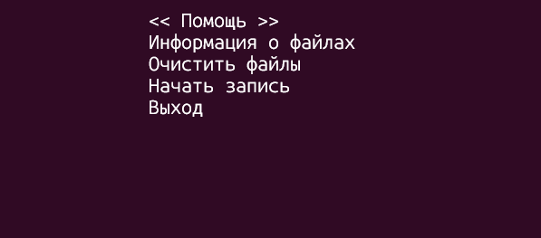
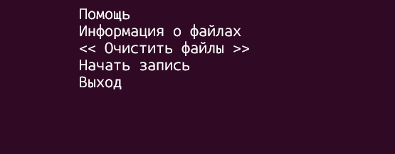

# Проект, реализованный в рамках лабораторных работ по ходу курса дисциплины "Программирование на языках высокого уровня".  
  
#### Задание к лабораторной работе:  
1. Подготовить первую программу, формирующую на основе информации, вводимой пользователем с клавиатуры, два внешних файла:
- файл ЭВМ: состоит из записей, каждая из которых включает три поля – марки ЭВМ, номера кафедры, заводского номера ЭВМ;
- файл сведений о конфигурации ЭВМ: состоит из записей, каждая из которых включает три поля – марки ЭВМ, количества терминалов и количества внешних запоминающих устройств.  
2. Подготовить вторую программу, формирующую сведения о конфигурации ЭВМ и количестве рабочих мест по кафедрам на основе данных из двух внешних файлов, сформированных в результате работы программы, подготовленной в п. 1.  
3. В процессе проектирования предусмотреть необходимые по смыслу задания проверки корректности данных, а также адекватное задаче взаимодействие с пользователем.  
**Во второй программе реализовать возможность вывода итоговой информации в двух режимах: избирательно на экран (по запросу пользователем конкретных данных с клавиатуры) и полностью в отдельный текстовый файл. Оба режима вывода должны предоставлять СГРУППИРОВАННУЮ ПО СМЫСЛУ информацию ИЗ ОБОИХ ВХОДНЫХ ФАЙЛОВ в виде, В УДОБНОМ ДЛЯ ВОСПРИЯТИЯ пользователем.** 
Учесть, что ограничения на размеры файлов отсутствуют, файлы в общем случае могут быть различной длины. 
В обязательном порядке использовать языковые средства организации программных единиц.   
Не использовать программные средства, поддерживающие работу с базами данных.
4. Программы подготовить с использованием средств одной из реализаций языка программирования С++, **в первой программе ввод и вывод информации реализовать при помощи средств языка программирования С.** Выполнить тестирование обеих программ согласно стратегии черного ящика, используя соответствующие критерии тестирования.  
  
#### Немного о реализации  
В процессе проектирования автором было принято решение реализовать в программах интерактивный интерфейс для удобства пользования. Для этого была применена библиотека ncurses.  
Ниже приведены примеры работы первой программы (Program-1).  
  
  
 